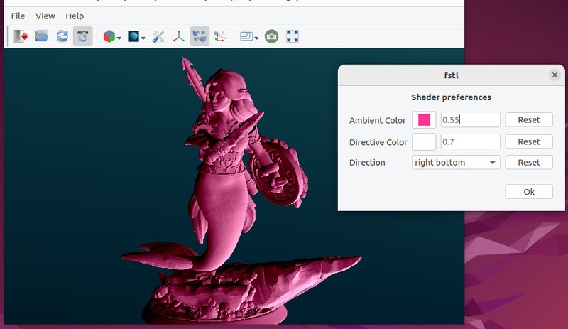
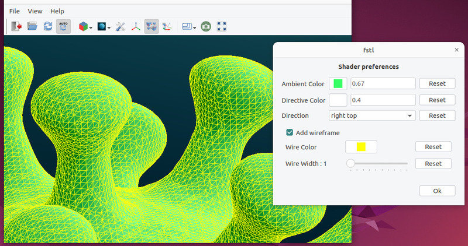

# fstl-e

`fstl-e` is a fork of `fstl` a very fast [.stl file](http://en.wikipedia.org/wiki/STL_\(file_format\)) viewer, available on github at [https://github.com/fstl-app/fstl](https://github.com/fstl-app/fstl). After making some contributions to it, I forked this version which retains `fstl` core functionalities but with some fancy enhancements.

## Screenshots



## Usage
Usage should be straightforward. Either use desktop integration to open a `stl` file or type `fstl-e myfile.stl` in a terminal.

### Shortcuts

  * H : Display help message
  * Q : Quit
  * O : Open
  * R : Reload
  * P : Draw Mode Settings for current shader (if available)
  * A : Draw Axes (and some informations)
  * M : Show/Hide Menu (and Toolbar as well)
  * S : Save Screenshot
  * F : Toggle Fullscreen
  * W : Toggle Wireframe on top of shader (if available)
  * Left Arrow : load previous stl file
  * Right Arrow : load next stl file
  * Up Arrow : use next shader
  * Down Arrow : use previous shader

## Build and Install

The only dependencies to build for `fstl-e` are [`Qt 5`](https://www.qt.io), [`cmake`](https://cmake.org/) and [`OpenGL`](https://www.opengl.org)

### Linux

fstl-e is available as :

  * flatpak : planned
  * snap : planned
  * AppImage : [fstl-e-996acf8-x86_64.AppImage](https://github.com/wdaniau/fstl/releases/download/fstl-e-v1.0.0/fstl-e-996acf8-x86_64.AppImage)
  * Ubuntu package : ubuntu packages are available on [ppa:wdaniau/custom](https://launchpad.net/~wdaniau/+archive/ubuntu/custom)
  * Source (see below for instructions)

#### Building and installing from source
```
$ git clone https://github.com/wdaniau/fstl
$ cd fstl
$ mkdir build
$ cd build
$ cmake -DCMAKE_INSTALL_PREFIX:PATH=/some/path ..
$ make
```

Choose `/some/path` according to where you want to install `fstl-e`. By runing `make install`, the following files will be installed :

  * `fstl-e` executable in `/some/path/bin`
  * desktop file in `/some/path/share/applications`
  * icons in `/some/path/share/icons/apps`

Standard choices are :

  * `/usr/local` : this is the default if `-DCMAKE_INSTALL_PREFIX` is omitted. Needs root privileges
  * `/usr` : not a good choice in my opinion as it may interfere with system packages. Needs root privileges
  * `$HOME/.local` : in most modern systems it is a good choice for a user installation as `$HOME/.local/bin` will be in `PATH` variable as well as `$HOME/.local/share` will be in `XDG_DATA_DIRS` variable.

##### Create a package using cpack
Alternatively after having run `make`, you can use `cpack` the packaging system integrated with `cmake` to build a package :

  * `cpack -G TGZ` will produce a `.tar.gz` package
  * `cpack -G DEB` will produce a `.deb` package
  * Although not tested as I'm not under a `rpm` distribution, running `cpack -G RPM` should produce a rpm package.


### Windows
I'm mainly a linux user and have very little skill under windows. However I managed to compile `fstl-e` by installing [Visual studio community edition](https://visualstudio.microsoft.com/fr/vs/community/) and [Qt Opensource](https://www.qt.io/download-thank-you?os=windows) and it was quite straightforward using qtcreator on CMakeLists.txt as project.

  * Windows installer : [fstl-e-1.0.0-win64.exe](https://github.com/wdaniau/fstl/releases/download/fstl-e-v1.0.0/fstl-e-1.0.0-win64.exe)


### macOS
I have absolutely no experience under macOS, however this should be possible to compile `fstl-e` by following the instructions on the [fstl github page](https://github.com/fstl-app/fstl).


--------------------------------------------------------------------------------
# fstl License

Copyright (c) 2014-2024 Matthew Keeter

Permission is hereby granted, free of charge, to any person obtaining a copy of this software and associated documentation files (the "Software"), to deal in the Software without restriction, including without limitation the rights to use, copy, modify, merge, publish, distribute, sublicense, and/or sell copies of the Software, and to permit persons to whom the Software is furnished to do so, subject to the following conditions:

The above copyright notice and this permission notice shall be included in all copies or substantial portions of the Software.

THE SOFTWARE IS PROVIDED "AS IS", WITHOUT WARRANTY OF ANY KIND, EXPRESS OR IMPLIED, INCLUDING BUT NOT LIMITED TO THE WARRANTIES OF MERCHANTABILITY, FITNESS FOR A PARTICULAR PURPOSE AND NONINFRINGEMENT. IN NO EVENT SHALL THE AUTHORS OR COPYRIGHT HOLDERS BE LIABLE FOR ANY CLAIM, DAMAGES OR OTHER LIABILITY, WHETHER IN AN ACTION OF CONTRACT, TORT OR OTHERWISE, ARISING FROM, OUT OF OR IN CONNECTION WITH THE SOFTWARE OR THE USE OR OTHER DEALINGS IN THE SOFTWARE.

--------------------------------------------------------------------------------
# fstl-e License

Copyright (c) 2023-2025 William Daniau

Permission is hereby granted, free of charge, to any person obtaining a copy of this software and associated documentation files (the "Software"), to deal in the Software without restriction, including without limitation the rights to use, copy, modify, merge, publish, distribute, sublicense, and/or sell copies of the Software, and to permit persons to whom the Software is furnished to do so, subject to the following conditions:

The above copyright notice and this permission notice shall be included in all copies or substantial portions of the Software.

THE SOFTWARE IS PROVIDED "AS IS", WITHOUT WARRANTY OF ANY KIND, EXPRESS OR IMPLIED, INCLUDING BUT NOT LIMITED TO THE WARRANTIES OF MERCHANTABILITY, FITNESS FOR A PARTICULAR PURPOSE AND NONINFRINGEMENT. IN NO EVENT SHALL THE AUTHORS OR COPYRIGHT HOLDERS BE LIABLE FOR ANY CLAIM, DAMAGES OR OTHER LIABILITY, WHETHER IN AN ACTION OF CONTRACT, TORT OR OTHERWISE, ARISING FROM, OUT OF OR IN CONNECTION WITH THE SOFTWARE OR THE USE OR OTHER DEALINGS IN THE SOFTWARE.
