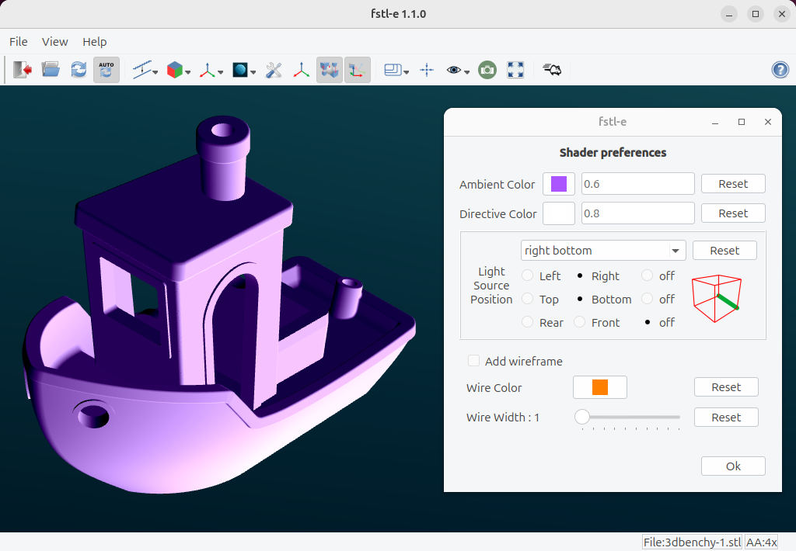
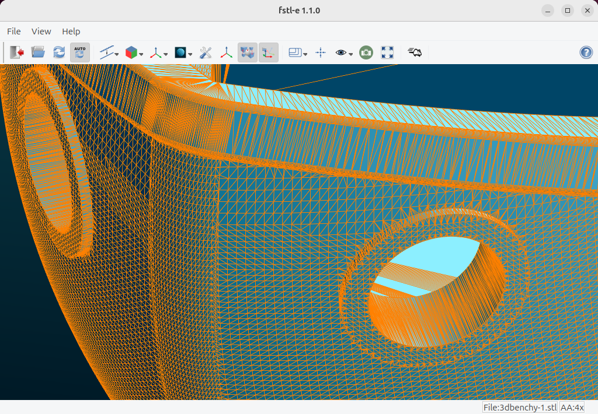
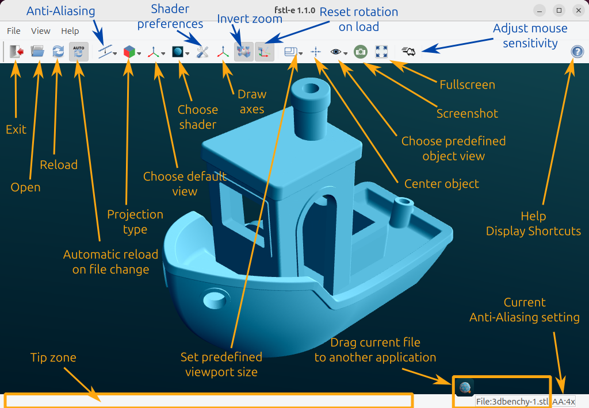

# fstl-e

`fstl-e` is a fork of `fstl` a very fast [.stl file](http://en.wikipedia.org/wiki/STL_\(file_format\)) viewer, available on github at [https://github.com/fstl-app/fstl](https://github.com/fstl-app/fstl). After making some contributions to it, I forked this version which retains `fstl` core functionalities but with some fancy enhancements.

## Screenshots



## Changelog
### fstl-e v1.2.0
  * Add configurable background (new feature by andreasbkrueger)
  * Minor bug correction

### fstl-e v1.1.0
  * Add statusbar with statustip and current file name which can be used to drop the current file to another application like a slicer.
  * Add anti-aliasing functionality
  * Add a menu to choose default rotation between 3 models.
  * Add action to recenter the view.
  * Add menu to choose between predefined views.
  * Add new predefined size HD1080 in viewport size menu.
  * Add popup slider to adjust mouse speed movement.
  * When using open menu, use most recent file's directory.
  * On the command line, can now open a directory.
  * In shader preferences, add a new way of choosing light source position.

## Known Issues
### aarch64 (tested on a raspberry5)
  * Compile and run perfectly well however :
    * the wireframe shader do not work.
    * available glsl version is 1.40, so the wireframe on top of mesh light shader do not work as 3.3 is needed.
    * With "Raspberry PI OS (bookworm)", rendering under `Wayland` is a little bit ugly. Either use X11 (`raspi-config`->`Advanced Options`->`Wayland`->`X11`) or force using `xcb` by either setting environment variable `QT_QPA_PLATFORM=xcb` either launch `fstl-e -platform xcb`. With "Ubuntu Desktop 24.04" however rendering is ok using wayland or x11.
  * It seems that for aarch64, both flatpak and snap runtimes for Qt do not support OpenGL but only OpenGL ES. As porting to OpenGL ES is not completely trivial, there will be not flatpak nor snap package for the moment.

### Wayland
  * The fullscreen function do not work under `Wayland` and therefore is deactivated. If you want it to work you can either:
    * run X11 instead of Wayland
    * set the environment variable `QT_QPA_PLATFORM=xcb`
    * run the program with option `-platform xcb`

## Usage
Usage should be quite straightforward. You may :

  * Use Drag & Drop to drop an `stl` file into `fstl-e` main window.
  * Use desktop integration to open a file
  * Use `File/Open` menu or toolbar `Open` icon
  * on the command line launch `fstl-e myfile.stl` or `fstl-e mydirectory`

Afterwards :

  * Left clic : rotate the object
  * Right clic : translate the object
  * Wheel : zoom in/out
  * You may also drag the file name from the statusbar to another application. (Be carefull though as dropping on the desktop will move the file there).

Here's an interface panorama (missing the new background settings button).



### Shortcuts

  * H : Display help message
  * Q : Quit
  * O : Open
  * R : Reload
  * P : Draw Mode Settings for current shader (if available)
  * B : Background Settings
  * A : Draw Axes (and some informations)
  * M : Show/Hide Menu (and Toolbar as well)
  * S : Save Screenshot
  * F : Toggle Fullscreen
  * W : Toggle Wireframe on top of shader (if available)
  * C : Center View
  * 0-6 : Apply Default, Top, Bottom, Front, Rear, Left, Right view
  * Left Arrow : load previous stl file
  * Right Arrow : load next stl file
  * Up Arrow : use next shader
  * Down Arrow : use previous shader

## Binary packages
### Latest
  * [fstl-e-v1.2.0](https://github.com/wdaniau/fstl/releases/tag/fstl-e-v1.2.0)

### Previous
  * [fstl-e-v1.1.0](https://github.com/wdaniau/fstl/releases/tag/fstl-e-v1.1.0)
  * [fstl-e-v1.0.0](https://github.com/wdaniau/fstl/releases/tag/fstl-e-v1.0.0)
  * [fstl-e-release-1](https://github.com/wdaniau/fstl/releases/tag/fstl-e-release-1)


## Build and Install from source

The only dependencies to build for `fstl-e` are [`Qt 5`](https://www.qt.io), [`cmake`](https://cmake.org/) and [`OpenGL`](https://www.opengl.org)

### Linux
```
$ git clone https://github.com/wdaniau/fstl
$ cd fstl
$ mkdir build
$ cd build
$ cmake -DCMAKE_INSTALL_PREFIX:PATH=/some/path ..
$ make
```

Choose `/some/path` according to where you want to install `fstl-e`. By runing `make install`, the following files will be installed :

  * `fstl-e` executable in `/some/path/bin`
  * desktop file in `/some/path/share/applications`
  * icons in `/some/path/share/icons/apps`

Standard choices are :

  * `/usr/local` : this is the default if `-DCMAKE_INSTALL_PREFIX` is omitted. Needs root privileges
  * `/usr` : not a good choice in my opinion as it may interfere with system packages. Needs root privileges
  * `$HOME/.local` : in most modern systems it is a good choice for a user installation as `$HOME/.local/bin` will be in `PATH` variable as well as `$HOME/.local/share` will be in `XDG_DATA_DIRS` variable. Add these if this is not the case.

#### Create a package using cpack
Alternatively after having run `make`, you can use `cpack` the packaging system integrated with `cmake` to build a package :

  * `cpack -G TGZ` will produce a `.tar.gz` package
  * `cpack -G DEB` will produce a `.deb` package
  * Although not tested as I'm not under a `rpm` distribution, running `cpack -G RPM` should produce a rpm package.


### Windows
I'm mainly a linux user and have very little skill under windows. However I managed to compile `fstl-e` by installing [Visual studio community edition](https://visualstudio.microsoft.com/fr/vs/community/) and [Qt Opensource](https://www.qt.io/download-thank-you?os=windows) and it was quite straightforward using qtcreator on CMakeLists.txt as project. The package installer was build with `cpack` and [nsis](https://nsis.sourceforge.io/Main_Page).


### macOS
I have absolutely no experience under macOS, however this should be possible to compile `fstl-e` by following the instructions on the [fstl github page](https://github.com/fstl-app/fstl).


--------------------------------------------------------------------------------
# fstl License

Copyright (c) 2014-2024 Matthew Keeter

Permission is hereby granted, free of charge, to any person obtaining a copy of this software and associated documentation files (the "Software"), to deal in the Software without restriction, including without limitation the rights to use, copy, modify, merge, publish, distribute, sublicense, and/or sell copies of the Software, and to permit persons to whom the Software is furnished to do so, subject to the following conditions:

The above copyright notice and this permission notice shall be included in all copies or substantial portions of the Software.

THE SOFTWARE IS PROVIDED "AS IS", WITHOUT WARRANTY OF ANY KIND, EXPRESS OR IMPLIED, INCLUDING BUT NOT LIMITED TO THE WARRANTIES OF MERCHANTABILITY, FITNESS FOR A PARTICULAR PURPOSE AND NONINFRINGEMENT. IN NO EVENT SHALL THE AUTHORS OR COPYRIGHT HOLDERS BE LIABLE FOR ANY CLAIM, DAMAGES OR OTHER LIABILITY, WHETHER IN AN ACTION OF CONTRACT, TORT OR OTHERWISE, ARISING FROM, OUT OF OR IN CONNECTION WITH THE SOFTWARE OR THE USE OR OTHER DEALINGS IN THE SOFTWARE.

--------------------------------------------------------------------------------
# fstl-e License

Copyright (c) 2023-2025 William Daniau

Permission is hereby granted, free of charge, to any person obtaining a copy of this software and associated documentation files (the "Software"), to deal in the Software without restriction, including without limitation the rights to use, copy, modify, merge, publish, distribute, sublicense, and/or sell copies of the Software, and to permit persons to whom the Software is furnished to do so, subject to the following conditions:

The above copyright notice and this permission notice shall be included in all copies or substantial portions of the Software.

THE SOFTWARE IS PROVIDED "AS IS", WITHOUT WARRANTY OF ANY KIND, EXPRESS OR IMPLIED, INCLUDING BUT NOT LIMITED TO THE WARRANTIES OF MERCHANTABILITY, FITNESS FOR A PARTICULAR PURPOSE AND NONINFRINGEMENT. IN NO EVENT SHALL THE AUTHORS OR COPYRIGHT HOLDERS BE LIABLE FOR ANY CLAIM, DAMAGES OR OTHER LIABILITY, WHETHER IN AN ACTION OF CONTRACT, TORT OR OTHERWISE, ARISING FROM, OUT OF OR IN CONNECTION WITH THE SOFTWARE OR THE USE OR OTHER DEALINGS IN THE SOFTWARE.
